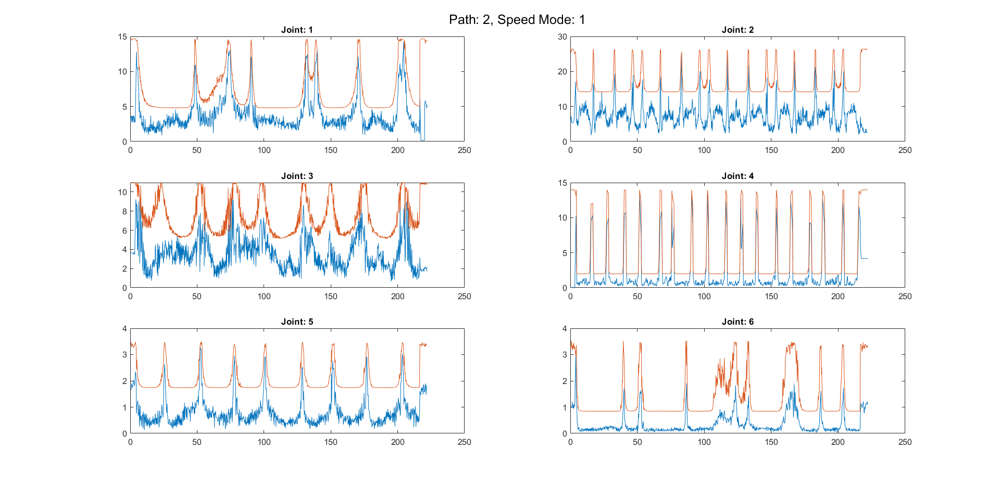
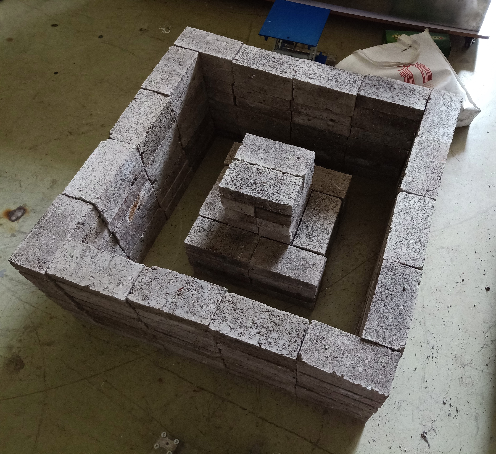
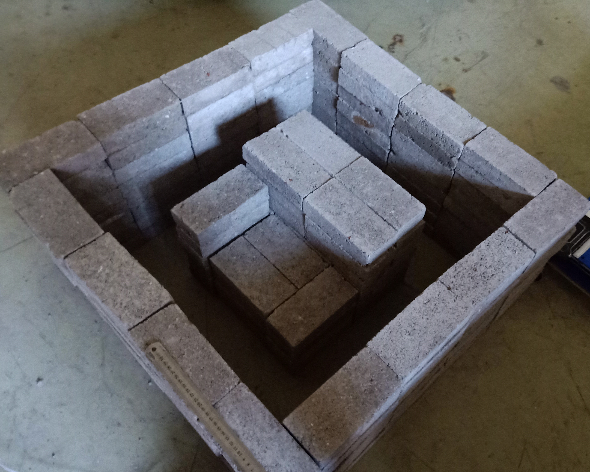
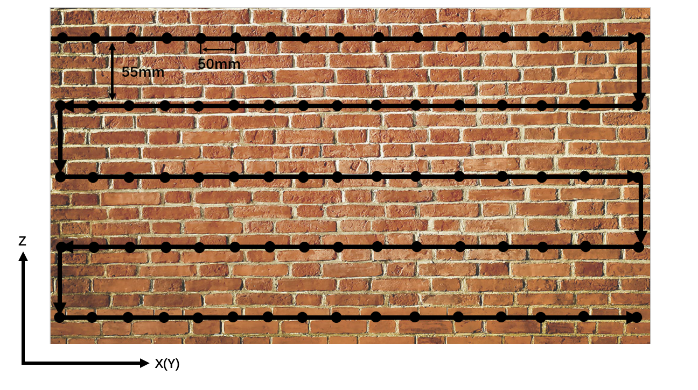

Here is a list of research works I've participated in during my undergraduate graduate study and graduate study.

## UAV Obstacle Avoidance and Collaboration with Autonomous Boats

**Jul 2021 - Present		Graduate research program of Mechanical Engineering at Purdue University**

- **Goal**: Build the programs for vision-based obstacle avoidance for UAVs and test collaborations with autonomous boats.
- **Supervisor**: *[Nina Mahmoudian](https://engineering.purdue.edu/ME/People/ptProfile?resource_id=211078)*, Associate Professor of Mechanical Engineering at Purdue University.
- **Main Tools**: ROS, Gazebo, Python
- **Responsibilities**
  - Develop the vision-based obstacle avoidance algorithms and simulate it on a quadcopter in Gazebo.
  - Implement it on a real quadcopter.
  - Develop the algorithms for collaborative work with autonomous boats.
- **Results**
  - This program is still in progress.

## Geometric Optimization in Computer Aided Design

**Aug 2021 - Present**		**Graduate research program of Mechanical Engineering at Purdue University**

- **Goal**: Obtain precise descriptions with parameters from hand-sketches and then optimize these parameters for design objectives.
- **Supervisor**:  *[Karthik Ramani](https://engineering.purdue.edu/ME/People/ptProfile?resource_id=12331)*, Donald W. Feddersen Distinguished Professor in Mechanical Engineering, Professor of Electrical and Computer Engineering, Professor of Educational Studies, College of Education (by courtesy) at Purdue University.
- **Main Tools**: Python
- **Responsibilities**
  - Implement B-spline fitting for free curves, including resampling and determining orders of the curves based on input sketches.
  - Optimize the obtained description with parameters for assigned design objectives.
- **Results**
  - This program is still in progress.

## Design of Annular Traverse System for Zucrow Lab of Purdue

**Jan 2020 - May 2020**		**Project for capstone course of Mechanical Engineering at Purdue University**

- **Goal**: Design a unique and relatively cheap annular traverse system for the wind tunnel in Zucrow Lab of Purdue, which requires the traverse system to have high resolutions and the ability to withstand high temperature and air pressure while preventing air leakage.

- **Supervisor**: *[Guilermo Paniagua](https://engineering.purdue.edu/ME/People/ptProfile?resource_id=113506)*, Professor of Mechanical Engineering, and Professor of Aeronautics & Astronautics (by Courtesy) at Purdue University.

- **Main Tools**: Solidworks.

- **Responsibilities**

  - Modify and make decisions for the final detailed design, including manufacturing methods or sources of supply.
  - Validate the whole system in Solidworks, create the explosive view and dynamic analysis.

- **Results**

  - This project won the **Best Engineering Prize** in [Malott Innovation Award of Mechanical Engineering](https://engineering.purdue.edu/ME/News/2020/who-will-win-best-senior-design-project-of-2020).
  - The traverse system is now being brought to reality in Zucrow Lab by faculties working there.

- **Final Presentation**

  
<embed src="https://Knoero.github.io/files/FDR_report.pdf" width="800" height="600" 
  type="application/pdf">

## Hybrid Electric Vehicle Control

**Sep 2019 - May 2020** 		**Undergraduate research program of Mechanical Engineering at Purdue University**

- **Goal**: Successfully implement the **Equivalent Consumption Minimization Strategy (ECMS)** and **Partial State of Charge (PSoC)** controlling strategy to a hybrid electric vehicle control.

- **Supervisor**: *[Peter Meckl](https://engineering.purdue.edu/ME/People/ptProfile?resource_id=11427)*, Assistant Head for Facilities and Operations, and Professor of Mechanical Engineering at Purdue University.

- **Main Tools**: MATLAB, SIMULINK.

- **Responsibility**

  - Debug the ECMS and PSoC algorithms in SIMULINK and check their feasibilities.
  - Reason the failures of previous implementations of ECMS and PSoC.

- **Results**

  - Proved the feasibilities by comparing their results with the minimization benchmark in simulation.
  - Located the abnormal vibration in previous implementations by tracking the data flow and proposed to fix the data collector at the acceleration pedal for successful implementation.

- **Semester Report**

  
<embed src="https://Knoero.github.io/files/HEV_report.pdf" width="800" height="600" 
   type="application/pdf">

## Robust Proprioceptive Robot Impact Design

**Jun 2019 - Aug 2019		Summer Internship in SJTU Robotics Lab**

- **Goal**: Find a dynamic threshold for torques of every joint in the 6-DOF old industry robot arm (only the current intensities were available).

- **Supervisor**: *[Jianhua Wu](https://me.sjtu.edu.cn/en/FullTimeTeacher/wujianhua.html)*, Associate Professor in Robotics Lab of SJTU.

- **Main Tools**: MATLAB, SIMULINK.

- **Responsibilities**

  - Construct and implement SIMULINK programs to operate the robot arm with different moving paths and speeds.
  - Get the torque information with the current intensities.
  - Design a dynamic threshold minimizing the area between the threshold and torque curve.

- **Results**

  - Managed to let the dynamic threshold follow the torque curve well in certain operating conditions while the required dynamic threshold varied greatly in different operating conditions.
  - Made the conclusion that constant parameters were not sufficient for an accurate threshold and implemented basic algorithms of **recursive least square estimation (RLSE)** for parameter estimation when operating.

  

  
One example of the dynamic thresholds on six joints

## 3D Through-wall Imaging With Unmanned Aerial Vehicles Using WIFI

**Feb 2018 - Oct 2018		Undergraduate research program of Mechanical Engineering in SJTU**

- **Goal**: Verify and reproduce the result of [a research paper from IEEE](https://dl.acm.org/doi/10.1145/3055031.3055084).

- **Supervisor**: *[Weiwei Cai](https://scholar.google.com/citations?user=4mYjOrsAAAAJ&hl=en)*, Associate professor in Institute of Turbomachinery of SJTU.

- **Main Tools**: Raspberry Pi 3 Model B, Arduino, Python.

- **Responsibility**: 

  - Buying components and build two simplest UAV.
  - Create simple modes of motion and tune the parameters so that the distance for each move step is fixed.
  - Organize the flight path and control the  two UAV flying through the desired path at the same time while sampling the WIFI signal strength automatically.
  - Help using the signal strength data to rebuild 3D model based on **Markov Random Field (MRF)** modelling.

- **Some photo records**

  - Different models used to test the algorithms

  

      
      
  

  

  - Pre-designed flight path for each UAV for analysis

    

- **Results**

  - Due to lack of sensors, no position feedback algorithms were used. The positions of UAV could only be automatically controlled by open-loop systems. Manually controlling the UAVs was required to ensure the two UAVs arrive at the correctly corresponding positions accurately.
  - Using the data collected by controlling the UAVs manually, two 2D images which were close to the projections were created successfully.
  - Due to time limitation of the research project, no digital 3D models were built.

