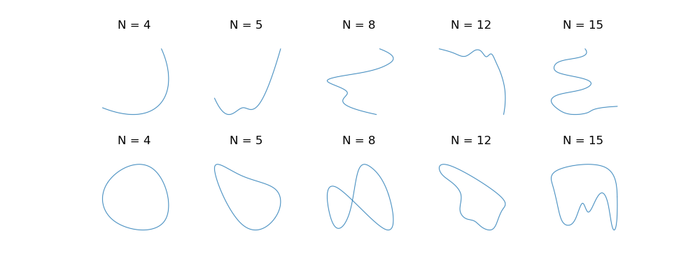

Here is a list of selected research works I've participated in during my undergraduate graduate study and graduate study.

## UAV Obstacle Avoidance and Collaboration with Autonomous Boats

**Jul 2021 - Present,		Graduate research program of Mechanical Engineering at Purdue University**

- **Goal**
  - Build the programs for vision-based obstacle avoidance for UAVs and test collaborations with autonomous boats.
- **Supervisor**
  - *[Nina Mahmoudian](https://engineering.purdue.edu/ME/People/ptProfile?resource_id=211078)*, Associate Professor of Mechanical Engineering at Purdue University.
- **Main Tools**
  - ROS
  - Gazebo
  - Python
- **Responsibilities**
  - Develop the vision-based obstacle avoidance algorithms and simulate it on a quadcopter in Gazebo.
  - Implement it on a real quadcopter.
  - Develop the algorithms for collaborative work with autonomous boats.
- **Results**
  - This program is still in progress.

## Geometric Optimization in Computer Aided Design

**Aug 2021 - Present,**		**Graduate research program of Mechanical Engineering at Purdue University**

- **Goal**

  - Precisely describe a given curve from hand sketches using a B-spline with no prior information about the curve.

- **Supervisor**

  - *[Karthik Ramani](https://engineering.purdue.edu/ME/People/ptProfile?resource_id=12331)*, Donald W. Feddersen Distinguished Professor in Mechanical Engineering, Professor of Electrical and Computer Engineering, Professor of Educational Studies, College of Education (by courtesy) at Purdue University.
  - *[Min Liu](https://engineering.purdue.edu/ME/Giving/Giving/FAQ/People/Areas/Areas/ptProfile?resource_id=188404&group_id=11989)*, Lecturer in Mechanical Engineering, Research Scientist in *[Convergence Design Lab](https://engineering.purdue.edu/cdesign/wp/current-convergence-design-lab-members/)* at Purdue University.

- **Main Tools**

  - Python
  - PyTorch

- **Responsibilities**
  
  - Analyze existing methods and look for possible improvements.
  - Develop the python programs for cooperative work with one existing sketch interface.
  
- **Results**

  - Given a fixed number of control points, solved for the optimization problem so that the reconstruction error is minimized by placing the control points.

  - For an arbitrary curve after segmentation of the sketch interface, constructed the workflow to find the optimal number of control points using machine learning methods, from generating the spline dataset to designing the training and validation processes.

    

    
Samples from the generated dataset

  - This project is uploaded to [Github](https://github.com/Knoero/BSplineFitting).

## Design of Annular Traverse System for Zucrow Lab of Purdue

**Jan 2020 - May 2020,**		**Project for capstone course of Mechanical Engineering at Purdue University**

- **Goal**: 

  - Design a unique and relatively cheap annular traverse system for the wind tunnel in Zucrow Lab of Purdue, which requires the traverse system to have high resolutions and the ability to withstand high temperature and air pressure while preventing air leakage.

- **Supervisor**

  - *[Guilermo Paniagua](https://engineering.purdue.edu/ME/People/ptProfile?resource_id=113506)*, Professor of Mechanical Engineering, and Professor of Aeronautics & Astronautics (by Courtesy) at Purdue University.

- **Main Tools**

  - Solidworks

- **Responsibilities**

  - Modify and make decisions for the final detailed design, including manufacturing methods or sources of supply.
  - Validate the whole system in Solidworks, create the explosive view and dynamic analysis.

- **Results**

  - This project won the **Best Engineering Prize** in *[Malott Innovation Award of Mechanical Engineering](https://engineering.purdue.edu/ME/News/2020/who-will-win-best-senior-design-project-of-2020)*.
  - The traverse system is now being brought to reality in Zucrow Lab by faculties working there.

- **Final Presentation**

  
<embed src="https://Knoero.github.io/files/FDR_report.pdf" width="800" height="600" 
  type="application/pdf">

- **Assembly Motion Study**

  <iframe 
          title="YouTube video player"
          width="800"
          height="400"
          src="https://youtube.com/embed/tAvmtdHgcsk"
          frameborder="0"
          allowfullscreen>   
  </iframe>

## Hybrid Electric Vehicle Control

**Sep 2019 - May 2020,** 		**Undergraduate research program of Mechanical Engineering at Purdue University**

- **Goal**: 

  - Successfully implement the **Equivalent Consumption Minimization Strategy (ECMS)** and **Partial State of Charge (PSoC)** controlling strategy to a hybrid electric vehicle control.

- **Supervisor**: 

  - *[Peter Meckl](https://engineering.purdue.edu/ME/People/ptProfile?resource_id=11427)*, Assistant Head for Facilities and Operations, and Professor of Mechanical Engineering at Purdue University.

- **Main Tools**

  - MATLAB
  - SIMULINK

- **Responsibility**

  - Debug the ECMS and PSoC algorithms in SIMULINK and check their feasibilities.
  - Reason the failures of previous implementations of ECMS and PSoC.

- **Results**

  - Proved the feasibilities by comparing their results with the minimization benchmark in simulation.
  - Located the abnormal vibration in previous implementations by tracking the data flow and proposed to fix the data collector at the acceleration pedal for successful implementation.

- **Semester Report**

  
<embed src="https://Knoero.github.io/files/HEV_report.pdf" width="800" height="600" 
   type="application/pdf">

## Robust Proprioceptive Robot Impact Detection

**Jun 2019 - Aug 2019,		Summer Internship in SJTU Robotics Lab**

- **Goal**

  - Find a dynamic threshold for torques of every joint in the 6-DOF old industry robot arm (only the current intensities were available).

- **Supervisor**

  - *[Jianhua Wu](https://me.sjtu.edu.cn/en/FullTimeTeacher/wujianhua.html)*, Associate Professor in Robotics Lab of SJTU.

- **Main Tools**

  - MATLAB
  - SIMULINK

- **Responsibilities**

  - Construct and implement SIMULINK programs to operate the robot arm with different moving paths and speeds.
  - Get the torque information with the current intensities.
  - Design a dynamic threshold minimizing the area between the threshold and torque curve.

- **Results**

  - Managed to let the dynamic threshold follow the torque curve well in certain operating conditions while the required dynamic threshold varied greatly in different operating conditions.
  - Made the conclusion that constant parameters were not sufficient for an accurate threshold and implemented basic algorithms of **recursive least square estimation (RLSE)** for parameter estimation when operating.

  

  
One example of the dynamic thresholds on six joints

